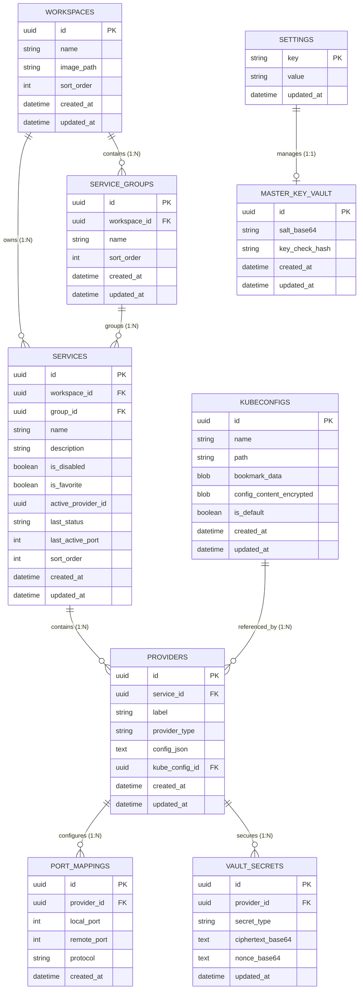

# 🗄️ Kuma Master Entity Relationship Diagram (ERD) & Database Schema

This document defines the complete 9-table SQLite database schema (managed via GRDB Swift) for Kuma. The schema is 100% normalized, type-safe, and absorbed from Kuma V3 upgraded structures.

---

## 📐 1. ERD Visualization (Mermaid Diagram)

---

## 🗃️ 2. Detailed Table Specifications (9 Tables)

### A. Table: `workspaces`
Stores environment groupings (Workspaces).
- `id` (TEXT/UUID, PK) — Unique identifier.
- `name` (TEXT, NOT NULL) — Workspace name (e.g. "E-Commerce Microservices").
- `image_path` (TEXT, NULLABLE) — Workspace avatar file path (managed by `WorkspaceImageStore` via `NSCache`).
- `sort_order` (INTEGER, DEFAULT 0) — Sidebar ordering position.
- `created_at` & `updated_at` (DATETIME, NOT NULL).

### B. Table: `service_groups`
Stores custom user groups/folders within a workspace (e.g., "Daily Backend Stack", "Payment Debugging").
- `id` (TEXT/UUID, PK).
- `workspace_id` (TEXT/UUID, FK -> `workspaces.id` ON DELETE CASCADE).
- `name` (TEXT, NOT NULL) — Group display name.
- `sort_order` (INTEGER, DEFAULT 0).
- `created_at` & `updated_at` (DATETIME, NOT NULL).

### C. Table: `services`
Stores main Service entities.
- `id` (TEXT/UUID, PK).
- `workspace_id` (TEXT/UUID, FK -> `workspaces.id` ON DELETE CASCADE).
- `group_id` (TEXT/UUID, NULLABLE, FK -> `service_groups.id` ON DELETE SET NULL) — Custom group folder reference.
- `name` (TEXT, NOT NULL) — Service name (e.g. "PostgreSQL Database").
- `description` (TEXT, NULLABLE) — Optional service notes / description.
- `is_disabled` (BOOLEAN, DEFAULT 0) — Active/disabled service toggle.
- `is_favorite` (BOOLEAN, DEFAULT 0) — Quick favorite pinned toggle for Sidebar Section 3.
- `active_provider_id` (TEXT/UUID, NULLABLE) — Managed by `ServiceAggregate` Root in Swift Data Layer (avoiding circular DDL FK locks).
- `last_status` (TEXT, DEFAULT 'stopped') — Last stable execution state (`stopped`, `running`, `failed`).
- `last_active_port` (INTEGER, NULLABLE) — Last active local port for auto-start restoration.
- `sort_order` (INTEGER, DEFAULT 0).
- `created_at` & `updated_at` (DATETIME, NOT NULL).

### D. Table: `providers`
Stores provider configurations (K8s, Docker, Shell, SSH, etc.).
- `id` (TEXT/UUID, PK).
- `service_id` (TEXT/UUID, FK -> `services.id` ON DELETE CASCADE).
- `label` (TEXT) — User display label.
- `provider_type` (TEXT, NOT NULL) — Discriminator string (`kube_port_forward`, `docker`, `shell`, `ssh`, `http_check`, `tunnel`, `process_monitor`).
- `config_json` (TEXT, NOT NULL) — JSON Payload of Swift `ProviderConfig` Enum.
- `kube_config_id` (TEXT/UUID, NULLABLE, FK -> `kubeconfigs.id` ON DELETE SET NULL) — **Primary Relational FK Source of Truth for SQL JOIN queries**.
- `created_at` & `updated_at` (DATETIME, NOT NULL).

### E. Table: `port_mappings`
Stores port forwarding mapping pairs (Local Port : Remote Port) per provider.
- `id` (TEXT/UUID, PK).
- `provider_id` (TEXT/UUID, FK -> `providers.id` ON DELETE CASCADE).
- `local_port` (INTEGER, NOT NULL).
- `remote_port` (INTEGER, NOT NULL).
- `protocol` (TEXT, DEFAULT 'tcp').
- `created_at` (DATETIME, NOT NULL).

### F. Table: `vault_secrets`
Stores encrypted SSH passwords, private keys, and auth tokens encrypted via Master Key Vault (AES-256-GCM).
- `id` (TEXT/UUID, PK).
- `provider_id` (TEXT/UUID, FK -> `providers.id` ON DELETE CASCADE).
- `secret_type` (TEXT, NOT NULL) — Discriminator (`ssh_password`, `ssh_private_key`, `auth_token`).
- `ciphertext_base64` (TEXT, NOT NULL) — AES-256-GCM encrypted payload.
- `nonce_base64` (TEXT, NOT NULL) — Unique initialization vector nonce per secret.
- `updated_at` (DATETIME, NOT NULL).

### G. Table: `kubeconfigs`
Stores registered KubeConfig references and Security-Scoped Bookmarks.
- `id` (TEXT/UUID, PK).
- `name` (TEXT, NOT NULL).
- `path` (TEXT, NOT NULL) — Disk file path (e.g. `~/.kube/config`). Primary Source of Truth.
- `bookmark_data` (BLOB, NULLABLE) — **Persistent Security-Scoped Bookmark Byte Data**. Essential for maintaining App Sandbox file access permission across app restarts.
- `config_content_encrypted` (BLOB/TEXT, NULLABLE) — Secondary Encrypted Backup.
- `is_default` (BOOLEAN, DEFAULT 0).
- `created_at` & `updated_at` (DATETIME, NOT NULL).

### H. Table: `master_key_vault`
Stores encryption salt and verification hash for Master Key Vault (AES-256-GCM).
- `id` (TEXT/UUID, PK).
- `salt_base64` (TEXT, NOT NULL).
- `key_check_hash` (TEXT, NOT NULL).
- `created_at` & `updated_at` (DATETIME, NOT NULL).

### I. Table: `settings`
Key-Value store for App User Preferences.
- `key` (TEXT, PK).
- `value` (TEXT, NOT NULL).
- `updated_at` (DATETIME, NOT NULL).
